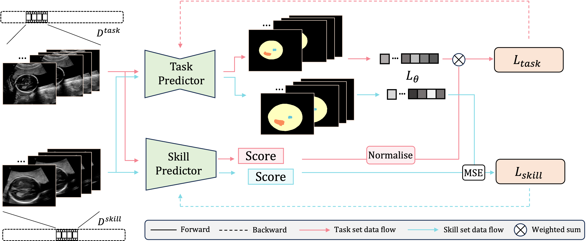

# Ultrasound-skill-assessment
Welcome to this repository for the implementation of the Paper "Learning to learn skill assessment for fetal ultrasound scans".

## Overview
We propose a novel approach using a specific clinical task to assess sonographer skill in fetal ultrasound. This method rates skills by how well a task is performed on the acquired fetal ultrasound images, without using manually predefined skill ratings. We consider the clinical task performed by a deep learning model, called a task predictor, and build a skill assessment model that predicts the performance of the task predictor as an indicator of skill associated with the acquired ultrasound scan.

## Installation

Download the repository `git clone https://github.com/pipiwang/Ultrasound-skill-assessment.git`

Install dependencies `pip install -r requirements.txt`

## Usage

Example train, test, and meta test script can be found in folder `./scripts`